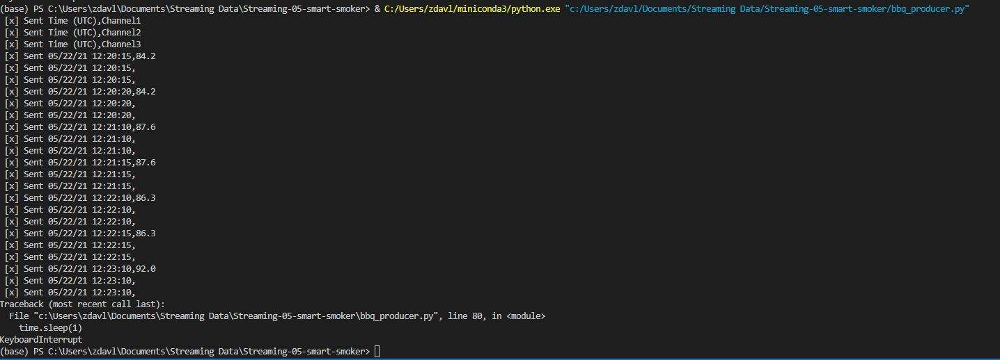

# Streaming-05-smart-smoker
bbq_producer is a producer that is streaming
smoker temperatures for the smoker and 2 different foods.
Each temperature is sent to a different queue and picked 
up by that queue's listener.
Author: Zak Davlin

General Design Questions

How many producers processes do you need to read the temperatures: We need only one producer 
How many queues do we use: 3 Queues, one temperatrue per queue.
How many listening callback functions do we need (Hint: one per queue): 3 Listenting functions

Requirements to run

RabbitMQ server running
pika installed in your active environment

You can change the host in the code
if you set show_offer to true it will bring up rabbitmq admin page. It is currently set to false.
Notice in my screenshot below I used a 1 second timer just for testing. I changed it to 30 seconds after I got my screenshot!
Screenshot!
